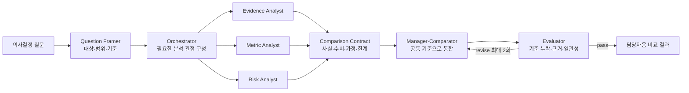

# Analysis Comparison Agent Harness

여러 자료를 요약해 붙이는 예시가 아니라, **비교 질문과 기준을 먼저 정하고 같은 형식으로 분석한 뒤 검증하는 Hybrid Harness**입니다.

## 사용한 패턴

| 패턴 | 사용하는 위치 | 이유 |
| --- | --- | --- |
| Prompt Chaining | 비교 준비 | 질문 → 기준 → 분석 → 비교 → 검증 순서를 고정 |
| Orchestrator-Workers | 분석 계획 | 요청마다 필요한 분석 관점이 달라짐 |
| Parallelization | 대안·관점별 분석 | 서로 독립된 분석을 동시에 수행 가능 |
| Result Contract | 분석 결과 전달 | 수치·근거·가정·한계를 같은 필드로 맞춤 |
| Manager·Agents as Tools | 종합 | Manager가 전문 분석 결과를 통합하고 최종 설명 소유 |
| Evaluator-Optimizer | 품질 검사 | 기준 누락이나 근거 없는 결론을 피드백 후 최대 2회 수정 |
| Human Decision | 마지막 | 실제 선택과 책임은 담당자가 수행 |

## 구조



## 파일

- `AGENTS.md`: 비교의 공정성, 근거, 결정 경계
- `workflow.md`: 질문 정의부터 평가까지의 순서
- `roles/`: 질문 설정, 근거·수치·위험 분석, 비교, 평가 책임
- `contracts/comparison-record.md`: 모든 대안을 같은 형식으로 만드는 필드
- `templates/comparison-report.md`: 비교표와 추천 근거 형식
- `checklists/domain-design-checklist.md`: 다른 분석 도메인으로 바꾸는 질문
- `policies/decision-boundary.md`: 분석과 최종 결정의 경계

## Codex에 요청하기

```text
AGENTS.md, workflow.md, roles/, contracts/, policies/를 먼저 읽으세요.

분석 전에 의사결정 질문, 비교 대상, 기준, 가중치, 제외 범위를 제시하세요.
승인된 기준으로 각 대안을 독립 분석하고 comparison-record 형식으로 맞추세요.
데이터가 없는 항목은 unknown으로 남기고, 추천에는 근거·가정·반대 근거·한계를 함께 적으세요.
최종 선택을 대신하지 마세요.
```
